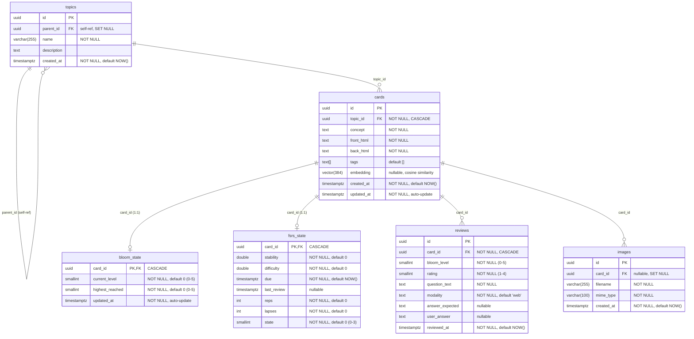

# LearnForge Database Class Diagram

## Table Descriptions

### topics
Hierarchical topic tree. Self-referencing `parent_id` allows unlimited nesting. Deleting a parent sets children's `parent_id` to NULL (orphans become root topics).

### cards
Flashcards belonging to a topic. Each card has HTML for front (question) and back (answer), a concept label, optional tags, and a 384-dimensional embedding vector (MiniLM-L6-v2) for similarity search. Cascade-deletes when the parent topic is removed.

### bloom_state
1:1 with cards. Tracks Bloom's Taxonomy progression:
- `current_level`: 0=Remember, 1=Understand, 2=Apply, 3=Analyze, 4=Evaluate, 5=Create
- `highest_reached`: watermark of the highest level ever achieved
- Transition: rating >= 3 advances one level, rating <= 2 drops one level

### fsrs_state
1:1 with cards. FSRS (Free Spaced Repetition Scheduler) scheduling state:
- `state`: 0=New, 1=Learning, 2=Review, 3=Relearning
- `stability`: interval (in days) at which recall probability = 90%
- `difficulty`: card difficulty parameter (0-10 range)
- `due`: next review timestamp
- Modality multipliers adjust intervals: chat (1.25x), web (1.0x), mcq (0.75x)
- Card maturity classification: Young (state=2, stability < 21d), Mature (state=2, stability >= 21d)

### reviews
Review log. Many reviews per card. Records the Bloom level at review time, the FSRS rating (1=Again, 2=Hard, 3=Good, 4=Easy), the question text used, the study modality (chat/web/mcq), the expected correct answer (`answer_expected`), and the user's actual response (`user_answer`). The `question_text` contains the full question including MCQ options; `answer_expected` stores the ideal answer and `user_answer` stores what the user responded, enabling review of past mistakes.

### images
File-based image storage. Optionally linked to a card (`SET NULL` on card delete so orphan images can be cleaned up separately). Physical files stored at `IMAGE_PATH`.

## Relationship Summary

| Relationship | Type | On Delete |
|---|---|---|
| topics.parent_id -> topics.id | self-ref, optional | SET NULL |
| cards.topic_id -> topics.id | many-to-one, required | CASCADE |
| bloom_state.card_id -> cards.id | one-to-one, PK+FK | CASCADE |
| fsrs_state.card_id -> cards.id | one-to-one, PK+FK | CASCADE |
| reviews.card_id -> cards.id | many-to-one, required | CASCADE |
| images.card_id -> cards.id | many-to-one, optional | SET NULL |
